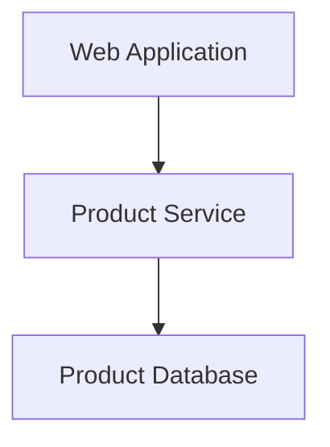
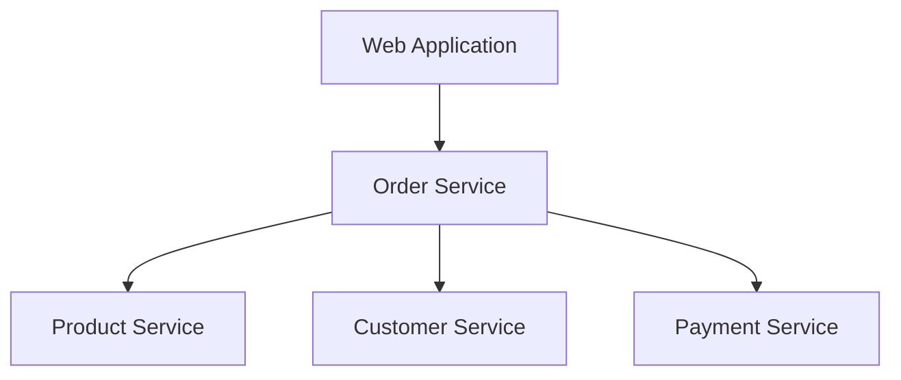
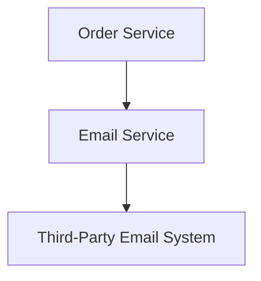
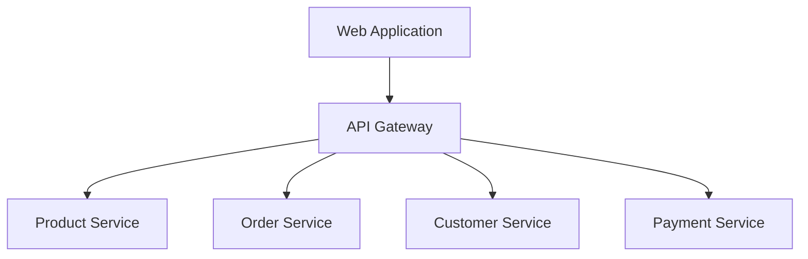

# Microservice Architecture: Solving Problems with Patterns

Microservice architectural styles are rapidly transforming the software development industry. As you embark on your journey into the world of microservices, you'll quickly realize that the challenges encountered in building, converting, and operating microservices are not unique. Fortunately, in software engineering, we often generate design patterns to solve problems once and reuse these solutions in similar situations. These patterns are valuable time-savers that let us focus on the most compelling parts of our jobs: addressing our business needs.

The goal of this guide is to familiarize you with common problems encountered when constructing microservices and common solutions to those problems. We will also introduce key terminologies that will be used when discussing microservices.

## Table of Contents

- [Understanding Microservice Vernacular](#understanding-microservice-vernacular)
  - [Service Types](#service-types)
  - [Platform Components](#platform-components)

## Understanding Microservice Vernacular

Before we dive deep into microservices design patterns, it's crucial to understand the vernacular often used in this domain. These terms are not definitive, but they provide a common language for discussing microservices. 

We can outline each service type through an online retail application.

### Service Types

#### Data Service

In a microservices architecture, a data service is primarily focused on managing and serving data related to a specific domain. This includes tasks like interfacing with databases or other data sources, applying data validation and transformation logic, and handling data-related business rules. 

In the context of an online retail application, an example of a data service could be a "Product Service". This service would manage all data and operations related to products: CRUD (Create, Read, Update, Delete) operations on product data, validating product data, and applying any necessary transformations.

In this diagram, the web application (Client) interacts with the Product Service (Data Service) which communicates with the Product Database (Data Source).

#### Business Service

Business services typically orchestrate multiple data services and handle more complex business logic. They are responsible for managing operations that involve multiple data domains and ensuring that the overall business rules and workflows are adhered to. 

In the online retail application, an example of a business service could be an "Order Service". The Order Service might interact with the Product Service to check product availability, a Customer Service to validate customer details, and a Payment Service to process payments. It would ensure that these operations are carried out in the correct order and that the overall business rules for order processing are adhered to.

In this example, the web application (Client) sends a request to the Order Service (Business Service), which then interacts with the Product Service, Customer Service, and Payment Service (Data Services) to orchestrate the operation.

#### Translation Service

A translation service acts as a layer of abstraction over external services or systems. It translates the microservice's internal data models and operations into the formats required by the external service, and vice versa. 

For instance, in the online retail application, an "Email Service" could act as a translation service. This service would take care of interfacing with an external email system. When the application needs to send an email (for example, an order confirmation email), it would pass the necessary data to the Email Service. The Email Service would then translate this into the format required by the external email system.

In this diagram, the Order Service (Client) uses the Email Service (Translation Service) which communicates with a Third-Party Email System.

#### Edge Service

Edge services are responsible for managing the interfaces between the microservice system and its users or external systems. They take care of tasks like request routing, data transformation for external consumption, security and access control, and protocol translation.

In the online retail application, an example of an edge service might be an "API Gateway". This service would expose APIs for clients like web browsers or mobile applications, route incoming requests to the appropriate internal services, transform internal data into the formats required by the clients, and handle tasks like authentication and rate limiting.

Here, the Web Application (Client) interacts with the API Gateway (Edge Service), which routes incoming requests to the appropriate internal services like the Product Service, Order Service, Customer Service, and Payment Service (Data Services).

### Platform Components

Platform components in a microservices architecture provide the shared infrastructure and tooling that the services rely on to operate effectively. They can be categorized into several areas:

- Runtime environment: This is where the services are actually run. It could be bare metal servers, VMs, or a container platform like Kubernetes.
- Ancillary services: These are additional services that the application services rely on to function. They could include things like databases, message queues, caching systems, and authentication servers.
- Operational tooling: These tools help with tasks like monitoring, logging, and alerting. They provide insight into the operation of the services and help with identifying and diagnosing issues.
- Diagnostic tooling: These tools assist with troubleshooting and performance tuning. They might include things like profiling tools, debuggers, and scriptable interfaces to the runtime environment and services.
