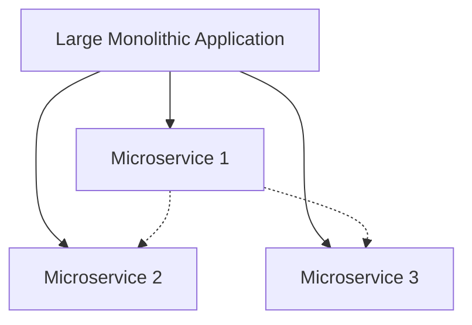

# Microservices and Cloud Native: Decoupling and Scalability

Understanding the relationship between microservices and cloud native architecture is essential to successfully navigating modern software development. We will debunk misconceptions about the interdependence of these two concepts and delve into their individual strengths and capabilities. Our focus will be on leveraging microservices in a cloud native pattern to construct robust, scalable systems.

## Table of Contents:
- [Understanding Cloud Native](#Understanding-Cloud-Native)
- [Exploring Microservices](#Exploring-Microservices)
- [Interplay between Cloud Native and Microservices](#Interplay-between-Cloud-Native-and-Microservices)

## Understanding Cloud Native 

Cloud Native is an architectural style, implying it does not prescribe a singular solution to a problem. Instead, it outlines strategies for creating systems that optimize for the cloud's unique operational environment. While it is frequently associated with cloud computing, Cloud Native can function anywhere and is not restricted to the cloud environment.

Key characteristics of Cloud Native applications include externalized configuration, scalability, swift application startup, and handling abrupt shutdowns gracefully. Notable patterns, like the 12-Factor or 15-Factor application guidelines, embody these principles.

Cloud Native applications are designed to be portable and scalable. Portability ensures the global deployment of applications without additional code changes. Scalability supports running your application as a single unit or multiple units based on your system's needs, potentially using auto-scaling features to respond to system load dynamically. Importantly, you can host Cloud Native designs in a single data center, enabling growth to multiple data centers as your business expands.

## Exploring Microservices 

Microservices represent smaller scoped units of work, yet their definition is subjective. They vary from nano services to smaller monoliths, but their size is determined by dependency graphs. Microservices break down larger systems, like those embodied in monolithic Java war files, into distinct units of work to scale independently.

These services encapsulate data domains, business domains, or functional domains as individual units. By analyzing call patterns and dependency graphs, we can determine optimal service boundaries.

The key attribute of microservices is their ability to scale independently. Thus, if one domain is under high demand, it can scale without affecting other domains and unnecessarily consuming resources. The size of a microservice is secondary to its ability to scale independently, preventing it from becoming a monolithic service artifact.

This diagram shows that a large monolithic application is broken down into three microservices. Microservice 2 and Microservice 3 are dependent on Microservice 1, illustrating how microservices can interrelate within a system.

## Interplay between Cloud Native and Microservices 

While Cloud Native development and Microservices architecture are distinct concepts, they share a focus on scalability. When developing Cloud Native systems, leveraging microservices often emerges as a clear path due to the shared emphasis on scalability, leading to a blurred understanding of these two topics.

However, you can pursue Cloud Native development without employing microservices, and you can build microservices without targeting Cloud Native deployments.

Yet, these distinct concepts are often discussed together due to their synergistic qualities. Their common emphasis on scalability makes microservices a favorable architectural style for Cloud Native deployments.

Even so, remember that they are not required of each other. It is possible to create monolithic applications that are Cloud Native or microservice designs that cannot run in a cloud environment without significant refactoring. 

1. **Monolithic applications that are Cloud Native:** Let's consider an application with all of its components – User Interface, Business Logic, and Data Access Layers – combined into a single application. It uses environment variables for configuration, maintains statelessness, logs to stdout, and is packaged inside a Docker container for portability.

   Although the application's architecture is monolithic, it follows the Cloud Native principles, such as external configuration, log aggregation, process disposability, and containerization. Therefore, it can still be considered Cloud Native.

2. **Microservice designs that cannot run in a cloud environment without significant refactoring:** Microservices aim to break down an application into smaller, independent services that can be developed, deployed, and scaled individually. However, just because an application is composed of microservices doesn't automatically make it Cloud Native.

   For instance, suppose an application's microservices are tightly coupled, share databases, do not have proper health checks in place, rely on local file storage, or are not designed to handle network failures. In that case, they may not work well in a cloud environment. To become Cloud Native, such applications might need significant refactoring to decouple services, implement database per service, build resilience into the application, and embrace other Cloud Native principles.
   
Despite any confusion or miscommunication, these two concepts have their unique definitions and strengths. They often work well together to solve common problems, but they are not mutually exclusive.
