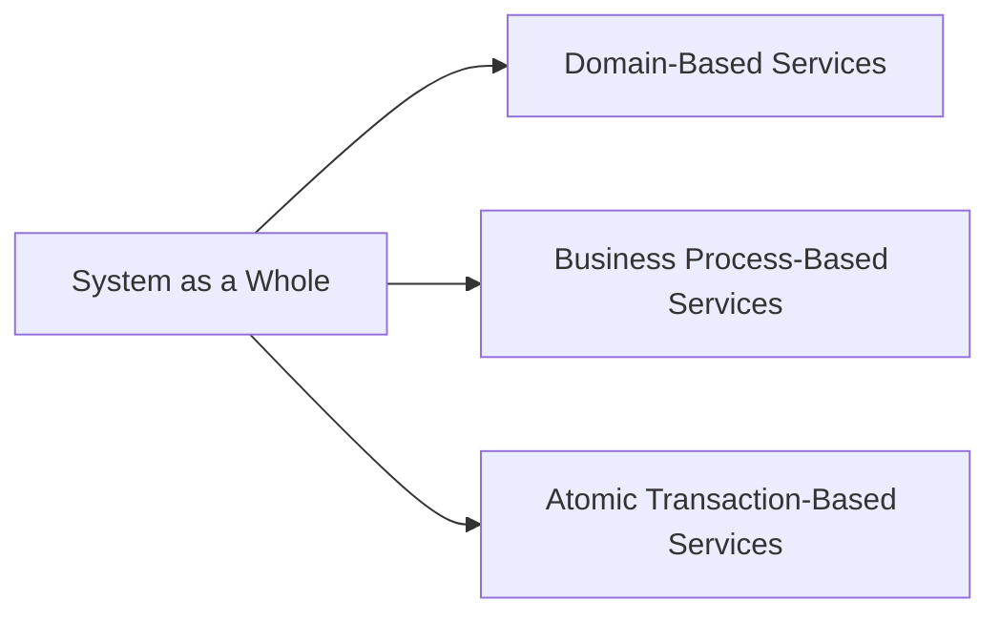
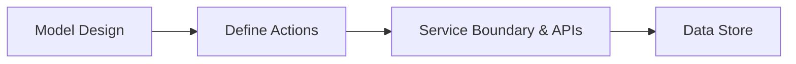
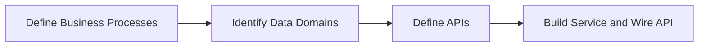
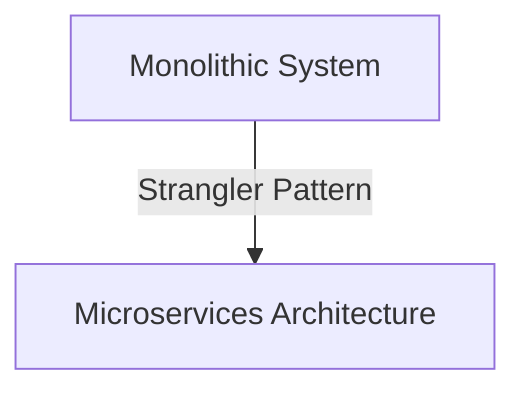
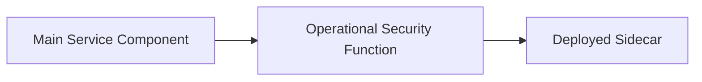

# Decomposition of a Monolithic Application into Microservices

In the world of software design and architecture, decomposition plays a pivotal role, much like breaking a complex problem into logical steps while writing software. This principle stands tall when we work with microservices, where we aim to dissect the complex, interwoven tapestry of problems in a system into manageable, smaller blocks of work. These blocks manifest as distinct services, each with a unique role within the overarching system. This modular approach is crucial for creating domain-based services, business process-based services, and atomic transaction-based services, which we will delve into further.

## Table of Contents

- [Service Types and Decomposition](#Service-Types-and-Decomposition)
- [Domain-Based Microservices](#Domain-Based-Microservices)
- [Business Process-Based Microservices](#Business-Process-Based-Microservices)
- [Atomic Transaction-Based Microservices](#Atomic-Transaction-Based-Microservices)
- [Functional Use Patterns](#Functional-Use-Patterns)
- [Strangler Pattern](#Strangler-Pattern)
- [Sidecar Pattern](#Sidecar-Pattern)

## Service Types and Decomposition

Our journey into the world of microservices begins by understanding the service types we can create. These are designed to cater to very specific uses across the system as a whole. Each service is a unique cog in the system, and through their creation, we break down the problems we need to solve into smaller, manageable blocks of work.



## Domain-Based Microservices

Domain-based microservices, rooted in domain-driven design patterns, are instrumental in a services architecture. At the heart of this concept is data domain decomposition, often the most granular level of decomposition found in a microservices architecture. The purpose of this is to enhance the scalability of services by making them more concentrated and smaller. These services are steered by the data domain, focusing solely on serving data as it is utilized across the system and applying logic strictly within the domain.

When designing domain-based services, the emphasis is on data access patterns, not the underlying schema. A common characteristic of these services is that they concentrate on data patterns within a specific domain. You will build decomposed services catering to a single data domain. Depending on the shared traits between domains, they may be merged into a single domain or split into separate domains. The key is to prioritize how the data is used throughout your system.

The process of designing your domains and corresponding domain services is not an exact science. It relies heavily on iterative trial and error, though with experience, this becomes more efficient. When developing services around data domains, the starting point should always be the model, not the database. The model is your domain's representation to the outside world, and it should be tailored to how it will be consumed.

The subsequent step involves defining the actions performed on these models, not necessarily limited to basic CRUD or REST operations. Actions can be incorporated into the API if they align with your domain.

Service definition ensues with the API contract, which concentrates on the model and not the underlying data store. From there, the process moves down to the storage of the data and the implementation of actions.

To better illustrate this, consider a simplified flow:



1. **Model Design**: Identify all attributes of the model.
2. **Define Actions**: Determine actions necessary for the model.
3. **Service Boundary & APIs**: Expose the defined actions through APIs.
4. **Data Store**: Develop a data store to house the model. The model doesn't need to match the schema in the data store.

This process is a simplified representation of domain-driven design and forms the basis for domain-based microservices. Among all patterns, this is the one you'll most frequently employ.

### Business Process-Based Microservices <a name="business-process-based"></a>

In complex scenarios where decompositions do not fit into a single domain, business process-based microservices come into play. These services offer a structured approach to your microservices architecture, resolving the issue of having to duplicate code logic across different components, especially when spanning multiple domains. Following the "Don't Repeat Yourself" (DRY)<sup>[1](#footnote-dry)</sup> principle and to simplify your architecture, you can use business process domains as a higher level of service within your architecture.

Business process services provide a higher level of abstraction that is closely tied to specific business functionality. This facilitates effective encapsulation and scalability within your system. Furthermore, they encapsulate related domains, albeit ensuring these domains require independent access as well. If data domains are consistently accessed through the process domain, the domain model might not be optimally constructed.

A crucial characteristic of business process services is their lack of independent data access, ensuring a clear boundary between business and data domains. While this rule is sometimes overlooked, maintaining such boundaries reduces future complexities. Also, these services should exhibit distinct functional uses to avoid inadvertently introducing a monolith into your system with business processes.

The procedure for creating a business process service entails:

1. Identifying the process for exposure. This requires thorough requirement gathering and a clear understanding of the data needed.
2. Identifying the necessary data domains.
3. Defining APIs handling your business processes, focusing on the contract, not the underlying models.
4. Constructing the service and connecting the API to the domain services client calls.



It's recommended to encapsulate business process code into its own module for ease of access and modification when business process changes occur. In the design strategy for business process services, the focus is on defining processes, identifying involved data domains, defining APIs for the business processes, and implementing the service while wiring it using client code to interact with data domains over REST. This modular approach to each process will simplify iteration when process changes are necessary.

## Atomic Transaction-Based Microservices

In a microservices architecture, there may be instances where true atomic transactions are necessary because eventual consistency isn't sufficient. These unique use cases call for the construction of special logic and systems.

One of the main characteristics of these services is their ability to ensure ACID-compliant<sup>[2](#footnote-acid)</sup> transactions across multiple data domains. If atomic transactions are needed within a single domain, there's no need for a specialized service, since the underlying implementation can manage this. However, when atomic transactions span multiple data domains, services that support failure domains may be needed. In these scenarios, these services should provide the ability to rollback the entire domain's scope in case of failure.

Atomic transaction services often require a blocking API call until a commit is successful. Even though this can logically be done asynchronously, the caller usually needs a guarantee of success or an error notification. Hence, the API must be synchronous and blocking.

However, attempting to use data domains with distributed transactions is not advisable due to the added complexity it introduces to the system.

### Designing Atomic Transaction-Based Microservices

Designing these atomic services can be relatively simple, but it requires thorough groundwork. Before you start, ensure that the service truly needs to be atomic. Often, stakeholders may request atomic transactions, but the actual need for them might not be as common. Therefore, it is important to communicate the complexity and constraints this decision could impose on the system to stakeholders and encourage them to consider alternatives.

Should the need for atomic transactions persist, the next step is to ensure that the underlying data domains share a database. If they don't, they need to be merged into a single shared database for the atomic service to be built. This action comes with its own set of risks that should also be communicated and understood by all stakeholders, as it involves modifying existing functionality.

Clear and precise rules about the transaction should be defined, including rollback conditions, since this will be a blocking call, which is not common in a distributed system. Consider documenting these rules in code comments or readme files for future reference.

Finally, implement the service as normal, but give more weight to fast failure even before initiating a transaction. Rollbacks take time, especially in blocking calls, and those confirmations from remote systems can become bottlenecks.

Avoid atomic transaction-based microservices if possible, as they can create complexities in distributed systems. They can limit effective database distribution and lead to network congestion. It's usually better to persuade stakeholders to accept eventual consistency or simulated rollbacks. However, each of these also has its own set of challenges, and all options should be thoroughly considered before committing to a single path.


## Functional Use Patterns

Besides service decomposition, it is crucial to understand functional use patterns that are often used to facilitate the migration from a monolithic system into a microservices architecture. We will delve into two commonly used patterns, the Strangler pattern and the Sidecar pattern.

## Strangler Pattern

The Strangler pattern is perhaps the most frequently discussed strategy in the context of transitioning from a monolithic system to a microservices architecture. This is because in most scenarios, the goal is not to create new systems but to break down existing monolithic systems.



## Sidecar Pattern

The Sidecar pattern is another pivotal strategy used to enforce the separation of concerns across the system. This pattern offloads operational security functions to separate components, which are then deployed alongside the main service component, thus avoiding the cluttering of our codebase with these functional needs.



Now that we have a broad overview, it's time to delve into domain-based services.

---
## Footnotes

<details>
  <summary><a name="footnote-dry">1</a>. The Don't Repeat Yourself (DRY) principle</summary>
  <br />
    The Don't Repeat Yourself (DRY) principle is a software development guideline aiming to reduce the repetition of code patterns. It promotes the concept that every piece of knowledge must have a single, unambiguous, and authoritative representation within a system. By avoiding code duplication, we improve the maintainability, understandability, and extensibility of the system, since any modification only needs to be applied in a single place.

  In the context of Business Process-based Microservices, the DRY principle has a pivotal role. Consider a scenario where you have different microservices, each implementing the same business logic or interacting with the same data domain in a similar fashion. This leads to code duplication, which contradicts the DRY principle and increases the risk of inconsistencies and errors.

  Business Process-based Microservices tackle this issue by encapsulating business logic that spans across multiple data domains into a single service. This way, the logic is written once and can be used by multiple consumers, avoiding code duplication. It helps keep your microservices clean, focused, and easy to maintain, thus adhering to the DRY principle.

  An example in C# could look like this:

  ```csharp
  public class OrderProcessService
  {
      private IInventoryService inventoryService;
      private IPaymentService paymentService;

      public OrderProcessService(IInventoryService inventoryService, IPaymentService paymentService)
      {
          this.inventoryService = inventoryService;
          this.paymentService = paymentService;
      }

      public bool ProcessOrder(Order order)
      {
          if(inventoryService.CheckInventory(order))
          {
              paymentService.ProcessPayment(order);
              return true;
          }

          return false;
      }
  }
  ```

  In the example, `OrderProcessService` uses `IInventoryService` and `IPaymentService` to process an order. If other services need to process an order, instead of repeating this logic, they can simply use `OrderProcessService.ProcessOrder()`, thus adhering to the DRY principle. [↩](#business-process-based)
  
</details>

<details>
  <summary><a name="footnote-acid">2</a>. ACID</summary>
  <br />
    ACID is an acronym standing for Atomicity, Consistency, Isolation, and Durability. It's a set of properties that guarantee reliable processing of database transactions. Here's a brief definition of each component:

1. **Atomicity**: This property ensures that a transaction is treated as a single, indivisible unit, which either succeeds completely, or fails completely. If any part of a transaction fails, the entire transaction fails, and the database state is left unchanged.

2. **Consistency**: Consistency guarantees that a transaction brings the database from one valid state to another. The database starts with data that adheres to certain rules and constraints, and the transaction ensures the rules remain in compliance after its execution.

3. **Isolation**: The isolation property ensures that concurrent execution of transactions leaves the database in the same state that would have been obtained if the transactions were executed sequentially.

4. **Durability**: Durability means that once a transaction has been committed, it will remain committed even in the case of a system failure. This is usually achieved by storing the transaction into a transaction log or a similar method.

ACID properties are critical in many database contexts, especially in scenarios where consistency and reliability of data are paramount. However, maintaining ACID properties can come at the cost of performance and scalability in distributed systems. [↩](#business-process-based)
  
</details>


