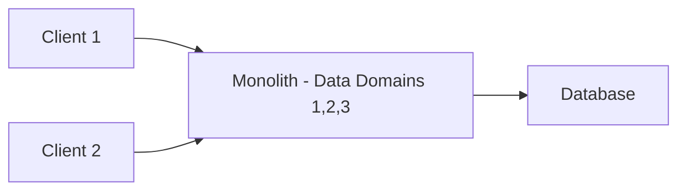
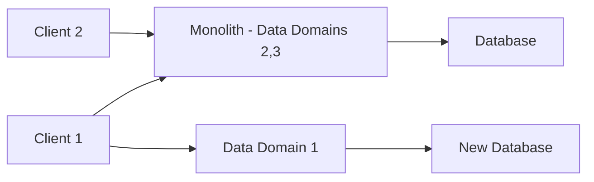
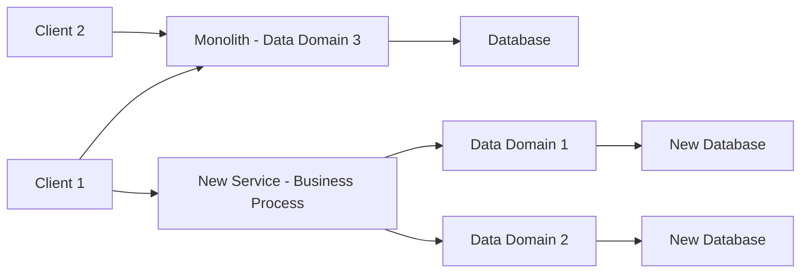
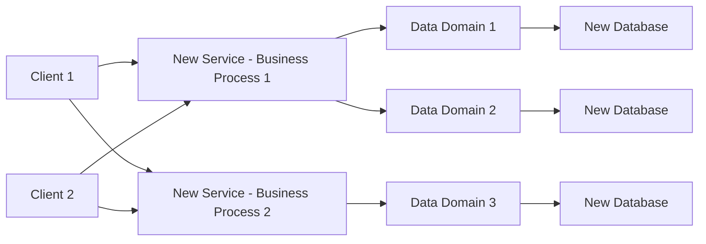

# The Strangler Pattern in Microservice Architecture Design

The Strangler Pattern is a crucial technique in the migration of legacy monolithic systems into more modern, scalable, and maintainable microservice architectures. Understanding this pattern and its application is key to successfully breaking down monolithic systems into microservices without causing undue disruption or requiring large-scale rewrites. This guide will walk you through the concept, as well as a practical step-by-step application of this pattern.

## Table of Contents
- [What is the Strangler Pattern?](#what-is-the-strangler-pattern)
- [Strangling a Monolith: Bottom-Up Approach](#strangling-a-monolith-bottom-up-approach)

## What is the Strangler Pattern?

In a nutshell, the Strangler Pattern is a method to gradually phase out a legacy system by replacing its functionalities piece by piece with new microservice endpoints. The key idea is to start with your monolith, identify and extract dependencies, and replace these dependencies with microservices. You "strangle" the monolith by sharding off services into microservice endpoints and redirecting dependencies to these new services. Eventually, the functionalities in the monolith are deprecated once all dependencies have been successfully migrated.

This migration can start either at the API layer or at the datastore. The starting point largely depends on the part of your system causing the most challenges. You can start by building out the API and the underlying service, then move the database behind it. Alternatively, you can start at the data store, move out the domains, and then move up the tree to the business processes. Both methods serve the same purpose: carving out functionalities from the monolith and replacing them with properly designed microservice artifacts.

Eventually, the processing is moved to the new microservices and the monolith is phased out, hence the term "strangled."

## Strangling a Monolith: Bottom-Up Approach

Let's illustrate the Strangler Pattern with a simple bottom-up approach. We will start with a monolithic system that includes a few clients and a database. Within this monolith, we have identified two business processes and three distinct data access areas or data domains.

### Initial Monolithic System

Here we have the monolith that encapsulates three data domains, served through a single database. Both clients are interacting with the monolith.

### Creation of a New Data Domain and Database

At this stage, a new database instance is created to hold the first data domain. Client 1 is then adjusted to interact with this new data domain, but still continues interacting with the monolith for the remaining data domains.

By this step, Client 1 no longer requires the first data domain from the monolith. This data domain can now be removed from the monolith's database.

### Moving Another Data Domain and a Business Process

Now we're moving another data domain and a business process from the monolith to a new service. The new service interacts with the previously migrated data domain and the newly migrated one.

### Strangling the Monolith Completely

Finally, all clients connect only to the new services, and the monolith can be deprecated. The final system architecture solely consists of microservices.

