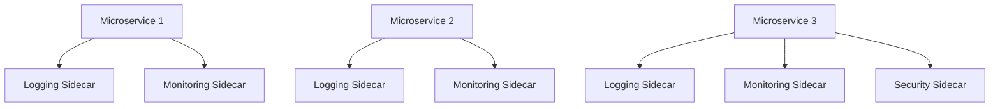

# Understanding the Sidecar Pattern in Microservices

The Sidecar Pattern is a significant design approach used in a microservices architecture that helps manage repeated code paths. This design pattern aids in offloading tasks like logging, monitoring, or network services from the main service to a distinct module, effectively increasing efficiency and manageability. 

## Table of Contents
- [Concept and Design](#concept-and-design)
- [Code Writing and Scheduling](#code-writing-and-scheduling)
- [Visualizing the Sidecar Pattern](#visualizing-the-sidecar-pattern)

## Concept and Design 

The fundamental aspect of the sidecar pattern involves defining a separate module that serves to offload specific tasks from the main service. This offloading module is referred to as a 'sidecar'. 

The main challenge in designing a sidecar lies in achieving the right balance between specificity and genericness. The module should be specific enough to cater to immediate needs, yet generic enough to be usable across different parts of the system. 

## Code Writing and Scheduling 

Upon designing the sidecar, the next phase is to write the code and then schedule the sidecar to deploy with the appropriate service. Usually, most microservices architectures use runtimes that have predefined sidecar processes or strategies. 

Deploying the sidecar usually happens via the parent service manifest or service definition. Once deployed, the sidecar's functionality will be available without having to modify the code of the main service application. This feature is the essence of the sidecar pattern. 

## Visualizing the Sidecar Pattern 

Let's visualize the sidecar pattern with an example involving three microservices and three types of sidecars - logging, monitoring, and security.

In this visualization, we begin with three microservices. The logging sidecar and monitoring sidecar are applied to all microservices. The security sidecar is applied only to Microservice 3. This deployment indicates the flexibility of the sidecar pattern: sidecars can be selectively applied as needed.

The power of sidecars lies in their scalability. As services scale, the associated sidecars scale along with them, thereby inheriting their functionalities. The sidecar pattern thus increases system efficiency, reduces redundancy, and simplifies code management.
