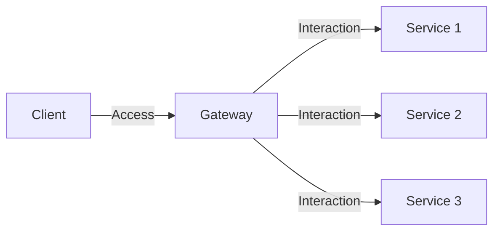

# Introducing the Gateway Pattern in Microservice Architecture

In Microservice architecture, one key concept that ensures effective integration and solves the problem of orchestration and Ingress across your system is the Gateway pattern. This pattern addresses the chaos that arises when clients access services indiscriminately, which can potentially cause operational and maintenance needs to skyrocket across the system. This guide will help you understand and implement the Gateway pattern effectively to provide a smooth and efficient interface for clients to communicate with your system services.

## Table of Contents

- [Understanding the Gateway Pattern](#understanding-the-gateway-pattern)
- [Problems Leading to the Creation of Gateway Pattern](#problems-leading-to-the-creation-of-gateway-pattern)
- [Defining a Contract in Gateway Pattern](#defining-a-contract-in-gateway-pattern)
- [Mutating and Limiting Calls](#mutating-and-limiting-calls)
- [Security and Authorization](#security-and-authorization)
- [Payload Decoration and Aggregation](#payload-decoration-and-aggregation)
- [Limiting Access and Providing a Movement Buffer](#limiting-access-and-providing-a-movement-buffer)
- [Building a Gateway: Strategies and Tips](#building-a-gateway-strategies-and-tips)

## Understanding the Gateway Pattern

The Gateway pattern provides a buffer between the underlying services and client needs, acting as the primary interface for external interactions. This concept can be visualized using the following diagram:



Despite its numerous benefits, it's crucial to remember that the Gateway can become a single point of failure for a system. It should, therefore, be designed to scale and respond well under high demand.

## Problems Leading to the Creation of Gateway Pattern

Several challenges in system design necessitated the creation of the Gateway pattern. Some of these are:

- **Decoupling**: Without a gateway, clients need to have knowledge about each individual service and their locations, leading to a tightly coupled system. The Gateway pattern provides a layer of abstraction, allowing services to change without impacting clients.

- **Security and Authorization**: Managing security and authorization can be cumbersome when handled separately for each service. With the Gateway pattern, these concerns are centralized, simplifying management and ensuring consistent policy enforcement.

- **Rate limiting and throttling**: Without a gateway, it would be difficult to control the number of requests each client can make, possibly leading to service overloads. The Gateway pattern can efficiently manage these concerns.

- **Protocol Translation**: Microservices in a system can communicate using various protocols. The gateway can provide a single point of protocol translation, making it easier for clients.

These challenges, among others, led to the development of the Gateway pattern, aiming to simplify the interaction between clients and services in a microservices architecture.

##  Defining a Contract in Gateway Pattern

In the context of the Gateway pattern, a contract is a well-defined, agreed-upon interface for communication between the client and the microservices through the gateway. It defines the APIs exposed by the gateway for interacting with the underlying services. 

A contract includes:
- The endpoints or URLs that can be accessed.
- The HTTP methods (GET, POST, PUT, DELETE, etc.) that are allowed for each endpoint.
- The expected request body structure for POST and PUT methods.
- The expected response body structure for each endpoint.
- Any headers that need to be included in the request (like authentication tokens).
- The expected error codes and their meanings. 

Maintaining contract consistency is critical for effective functioning and is typically managed using strict version control systems like semantic versioning.

## Mutating and Limiting Calls

A key feature of a Gateway is its ability to mutate calls, simply proxy calls, or limit them based on its exposed functionalities. Here's a simple code block illustrating this idea in C#:

```csharp
public class Gateway
{
    private Service service;

    public Gateway(Service service)
    {
        this.service = service;
    }

    public Response ProxyCall(Request request)
    {
        return service.HandleRequest(request);
    }

    public Response MutateCall(Request request)
    {
        // Mutate the request here
        return service.HandleRequest(request);
    }
}
```

## Security and Authorization

Gateways can serve as an important security measure by restricting or allowing access based on client credentials. Only the Gateway itself needs public Ingress, providing a buffer for your internal system against public exposure. Here's a rudimentary example of this concept:

```csharp
public class Gateway
{
    private AuthService authService;

    public Gateway(AuthService authService)
    {
        this.authService = authService;
    }

    public Response HandleRequest(Request request, Credentials credentials)
    {
        if (!authService.Validate(credentials))
        {
            throw new UnauthorizedAccessException();
        }

        // Handle the request here
        return new Response();
    }
}
```

## Payload Decoration and Aggregation

The Gateway can decorate payloads by adding common headers or data points not necessarily relevant to the underlying service. This helps maintain consistency across different interactions. Moreover, it can aggregate payloads, bundling multiple data points into a single payload for high-bandwidth clients.

Note: Be cautious not to incorporate business logic into this aggregation, as it can lead to an unmanageable Gateway.

## Limiting Access and Providing a Movement Buffer

In certain scenarios, it's necessary to limit the data sent to clients. For instance, lower bandwidth mobile clients may not have the capacity to handle a full API call. A Gateway can help limit this data, allowing flexibility across different types of clients. 

One of the significant benefits of the Gateway pattern is providing a movement buffer. Even if underlying services change, migrate, or move, the Gateway can maintain a consistent API point for the clients. 

## Building a Gateway: Strategies and Tips

The strategy for building a Gateway is straightforward. First, define your contracts. Remember, these are your public touchpoints, so they should be clear and consistent. The APIs should be static or at least passive contracts, and they can be tailored for specific clients. 

Version control (like semantic versioning) is crucial to maintaining these contracts and ensuring passive behavior. Changes should be based on this versioning strategy. Here's a simple example of versioning in C#:

Lastly, it's recommended to build your internal client code in distinct modules and consume those modules within your implementation. This isolates the backend changes while keeping the public contract solid.

With a thorough understanding and careful application of the Gateway pattern, you can effectively manage and control client interactions in your Microservice architecture.
