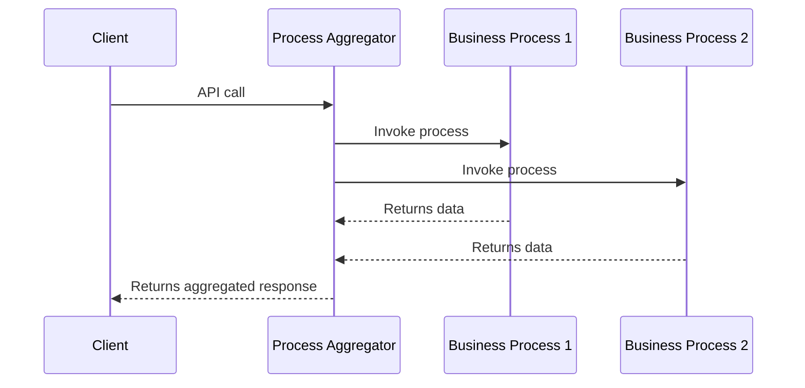

# Process Aggregator Pattern in Microservice Architecture Design

The Process Aggregator pattern represents an orchestration pattern that facilitates the development of complex processes within your system. This pattern is particularly useful when there's a need to call multiple data domains together within a business process.

## Table of Contents
- [Understanding the Process Aggregator Pattern](#understanding-the-process-aggregator-pattern)
- [Designing the Process Aggregator](#designing-the-process-aggregator)
- [Implementation Caveats](#implementation-caveats)
- [Conclusion](#conclusion)

## Understanding the Process Aggregator Pattern

In certain use cases, there might be a need to invoke multiple business processes concurrently and form a composite response. The Process Aggregator pattern enables this by providing clients with a single API to call. This API contract handles the underlying business process calls and assembles the payload for the client system.

The Process Aggregator is more than just a mechanism to group calls; it should also encapsulate its processing logic. For instance, if every client has to reproduce a set of rules when calling multiple business processes, it contradicts the DRY (Don't Repeat Yourself) principle. To adhere to this principle, the Process Aggregator encapsulates these rules and compiles the payload for the client, consisting of only the relevant parts of the model for the aggregation call.

However, note that improper use of this pattern can introduce a choke point into your system, causing network I/O to increase, wait times to rise, and the system's overall performance to degrade.

## Designing the Process Aggregator

The design and construction of a Process Aggregator involve the following steps:

1. **Identify the Business Processes**: Understand which business processes are needed behind the aggregator. Having a good understanding of these processes will inform your design decisions.

2. **Define the Processing Rules**: Determine the rules that govern the processing. This will again help guide your design choices.

3. **Develop a New Model**: Based on the previous steps, define a new model for your aggregator. This shouldn't be a simple pass-through and consolidation of your underlying processes because your internal processing rules will most likely alter the model.

4. **Design the API**: Once you have your model, you can design the API based on that model. If the model is designed correctly, standard REST verbs can be used on these models.

5. **Implement the Service**: Wire the service together and implement the internal processing features. It's crucial to encapsulate your internal business processing rules to prevent potential issues in the future.

Encapsulating your internal business processing rules not only simplifies design but also improves the maintainability of your system.

## Implementation Caveats

Though the Process Aggregator pattern is beneficial in some cases, it should be used with caution. It can potentially introduce a choke point in your system, especially in cases like a loan process where there are several business processes and multiple data domains at play. In such situations, it might be more beneficial to consider asynchronous patterns instead of aggregators.

Moreover, it's important to remember that abstraction for the sake of abstraction serves no purpose in a distributed microservices architecture. If you find yourself heading down that path, you might encounter network issues in the future.

## Conclusion

The Process Aggregator pattern is a powerful tool to have in your microservices architecture toolbox. However, it's not a silver bullet for all scenarios. Understanding when to apply it effectively is as crucial as understanding how to implement it. When used judiciously, it can simplify your system's design and enhance its maintainability, while avoiding unnecessary complications.
