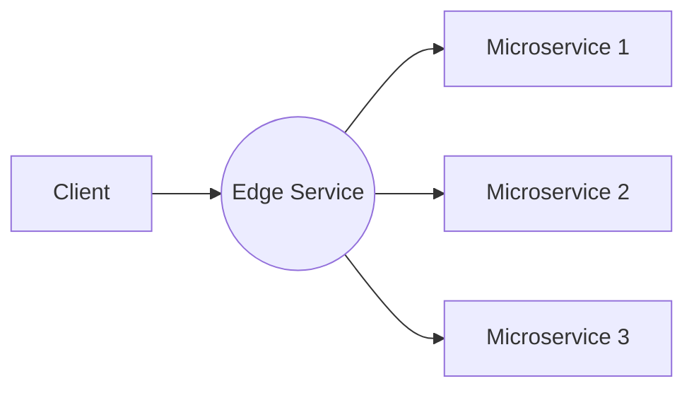
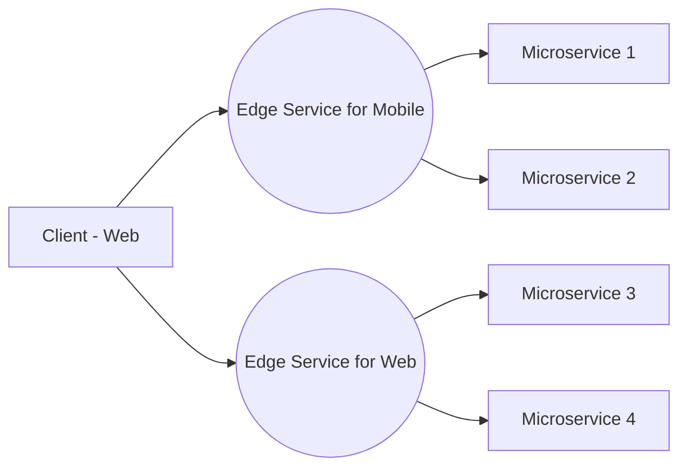
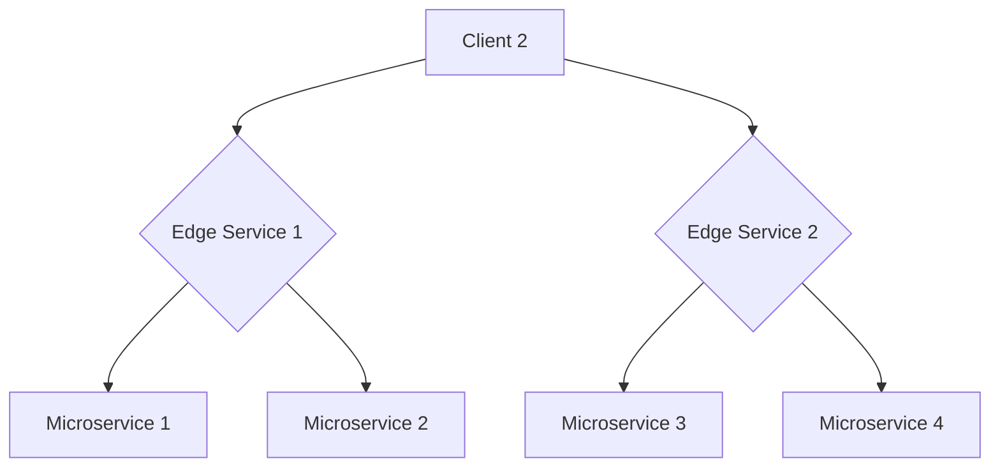

# Understanding and Implementing the Edge Pattern in Microservice Architecture

The Edge Pattern is an integral part of Microservice Architecture Design that aims to solve specific problems in gateway integration. It's a variant of the Gateway pattern, primarily used to address scaling concerns when certain client types disproportionately contribute to the request volume. Moreover, it's instrumental in cases where the client necessitates special business logic specific to their needs.

## Table of Contents
- [Conceptualizing the Edge Pattern](#conceptualizing-the-edge-pattern)
- [Problem Solving with the Edge Pattern](#problem-solving-with-the-edge-pattern)
- [Designing the Edge Pattern](#designing-the-edge-pattern)
- [Edge Vs. Gateway: A Comparative Analysis](#edge-vs-gateway-a-comparative-analysis)
- [Advantages of the Edge Pattern](#advantages-of-the-edge-pattern)
- [Conclusion: Choosing the Right Pattern](#conclusion-choosing-the-right-pattern)

## Conceptualizing the Edge Pattern
The Edge Pattern's central premise is to provide client-specific gateways, also known as Edge Services. These services offer benefits like aggregation, consolidation, and complexity isolation while catering to a specific client's unique needs. By focusing on a specific client, these services directly address the client's isolation pattern, ensuring that the system can scale efficiently without exposing irrelevant data to the client. 

Consider a scenario where certain data is irrelevant for a mobile client because it isn't available in the application. An Edge Service in such cases targets the payload, allowing the system to scale according to need without exposing the unnecessary data to the client.

## Problem Solving with the Edge Pattern
The Edge Pattern is designed to address two main problems in microservice architecture:

### 1. Scaling Concerns
In a system where different client types are interacting with the system, there might be cases where one client type (e.g., mobile) significantly contributes more to the request volume than others. This can create a scaling issue where scaling the Gateway to accommodate the high request volume becomes wasteful. The Edge pattern provides a solution by creating client-specific Edge Services that can scale according to the specific client's needs. This way, the scaling is more efficient and doesn't lead to resource wastage.

### 2. Client-Specific Business Logic
There can be scenarios where a client needs more than just a single touch point with the system - it might require special business logic that only applies to that client. The Gateway pattern falls short in these cases because it provides a common interface to all services, without any client-specific logic. This is where the Edge pattern shines - it provides client-specific gateways (Edge Services) that can incorporate specific business logic for each client, providing a more tailored experience.

By addressing these two main problems, the Edge Pattern proves itself as a crucial design pattern in microservice architecture, especially in scenarios where client-specific customization and scalability are of high importance.

## Designing the Edge Pattern
When designing an Edge Service, it's crucial to identify your client's needs and constraints. As the focus is primarily on one client, it's feasible to spend dedicated time and resources on understanding the client's requirements. Following this, the next steps involve building contracts and associated models and implementing the APIs for your client Edge Service.

Another significant advantage of the Edge Pattern is that the longevity of your passivity concerns is only as long as your client version remains in scope. This is especially beneficial in areas like mobile development, where application-driven upgrades can help maintain your client usage at a relatively current level. Thus, it's easier to introduce non-passive changes by compelling a client upgrade.

## Edge Vs. Gateway: A Comparative Analysis
While the Edge and Gateway Services appear very similar, their usage scenarios and flexibility significantly differ. The Edge Pattern is more versatile because it targets the clients specifically. It allows more robust handling of aggregation needs, and its consolidation and isolation needs are also more flexible. 

One of the key benefits of the Edge Pattern is its scalability. Since the pattern targets a single client, it allows the service to scale up or down based on the client load. Furthermore, it offers a better platform for client-specific throttling without applying it to the whole system as would be required with a Gateway.

However, the Gateway Pattern has the advantage when it comes to maintenance. It facilitates the consolidation of modules and underlying processing, making it easier to keep clients in sync. It also reduces the number of instance types across the system, improving maintainability.

## Advantages of the Edge Pattern
The Edge Pattern is inherently flexible when new clients come on board. Its implementation doesn't impact other systems when a new client joins. In contrast, a Gateway requires deploying the entire Gateway to accommodate the needs of new clients. 

Furthermore, deploying new versions of your Edge Services impacts fewer client types since they're very targeted. This approach is beneficial for isolating clients and preventing your entire system from exposure. It also safeguards clients from calling unapproved APIs. Combined with OAuth, it leads to a robust security footprint for Edge Services.

## Conclusion: Choosing the Right Pattern
While both the Gateway and Edge patterns have their merits, the choice heavily depends on the specific requirements.

Remember, the key is not necessarily to choose one over the other, but to understand when and where to apply each pattern effectively within your Microservice Architecture Design.
