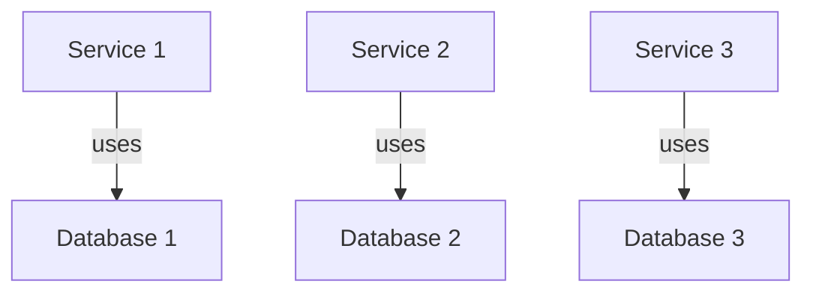
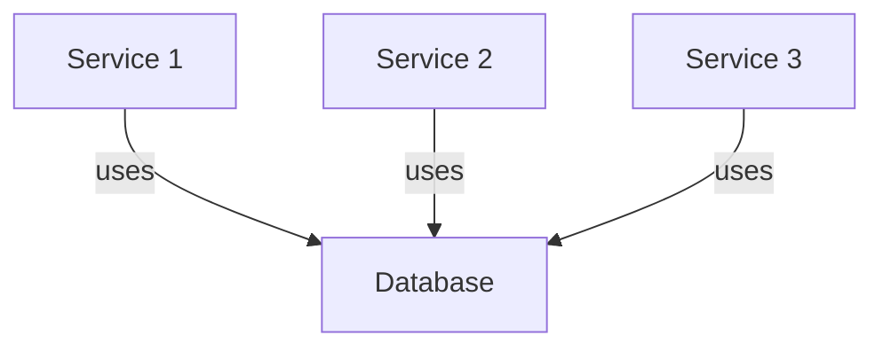

# Data Patterns in Microservice Architecture: Single and Shared Service Databases 

Microservices architecture offers a host of benefits, but with it comes the challenge of managing data across various services. Two common strategies of dealing with this are the Single Service Database Pattern and the Shared Service Database Pattern. This document explores these two patterns in detail.

## Table of Contents
- [Single Service Database Pattern](#Single-Service-Database-Pattern)
- [Shared Service Database Pattern](#Shared-Service-Database-Pattern)

## Single Service Database Pattern
<a id="Single-Service-Database-Pattern"></a>

The Single Service Database Pattern is a prevalent strategy for managing data in a microservices architecture. The premise of this pattern is simple, yet its implementation can become complicated due to costs associated with proprietary or improperly-sized databases.



The key objective of this pattern is scalability. The single service's scalability needs are in proportion to the database scaling requirements. As the load on a service increases, the associated use of the database will also increase. This often leads to sizing the database based on a single service's peak needs while the entire system is underutilized.

Each data domain gets its dedicated data store in this pattern, although this requires thoughtful application if the domain is part of an atomic transaction.


As your service scales, your data store itself also scales. The primary advantage is that both the data domain and data store are isolated, allowing them to scale up or down without impacting the system as a whole. In an advanced implementation, you could isolate your data per region while your system continues to function as a whole.

## Shared Service Database Pattern
<a id="Shared-Service-Database-Pattern"></a>

Sometimes, due to pre-existing contracts or enterprise constructs, you may need to implement a Shared Service Database Pattern. This pattern is not new, especially if you have some application development experience.

In this scenario, all data domains exist within a single database instance. But, even though they physically reside in a single instance, they can be treated as separate databases in code.



The database should handle data distribution across multiple data centers, as pushing this responsibility to the code can cause databases to become out of sync. Choose your databases wisely, as replication across WAN gateways can be an afterthought for some modern databases, resulting in the loss of database functionality.

```csharp
// Define schemas for logical grouping
Schema usersSchema = new Schema("Users");
Schema ordersSchema = new Schema("Orders");
Schema inventorySchema = new Schema("Inventory");

// Unique credentials per schema
Credentials usersCredentials = new Credentials("UsersUser", "UsersPassword");
Credentials ordersCredentials = new Credentials("OrdersUser", "OrdersPassword");
Credentials inventoryCredentials = new Credentials("InventoryUser", "InventoryPassword");
```

Even though the database is shared, structuring your data can allow for its eventual isolation. This is achieved by using schemas, keyspaces, or similar logical groupings within the database engine. Each schema and each service consuming that schema should have unique credentials that never span the logical breaks. Additionally, the data domain should connect to a single schema.

By enforcing this pattern, you can prepare for a possible future division of the database, as the data and apps are already logically isolated.
