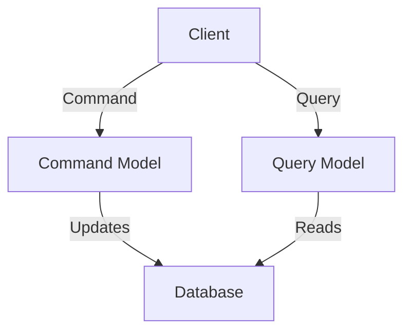
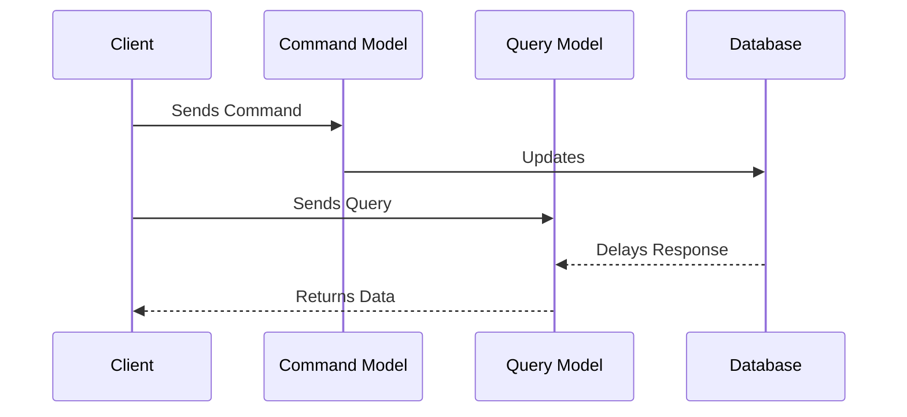

# Introducing The CQRS Principle

In our exploration of microservice architecture design, we encounter a wide array of data patterns. Among these, the Command Query Responsibility Segregation (CQRS) pattern stands out for its complexity and immense transformative potential when effectively applied. It's a principle that can fundamentally enhance the data behavior across a system, albeit not without significant challenge and careful consideration.

## Table of Contents
- [The CQRS Principle](#the-cqrs-principle)
- [Divergence from CRUD](#divergence-from-crud)
- [When to Use CQRS](#when-to-use-cqrs)
- [The Complexity and Potential of CQRS](#the-complexity-and-potential-of-cqrs)

## The CQRS Principle

At its heart, CQRS addresses a specific issue: the divergence of data access patterns from traditional Create-Read-Update-Delete (CRUD) approaches towards more intricate multi-model patterns within a single bounded context or data delay. This pattern becomes particularly evident when we employ multiple interfaces.

In the CQRS model, query interfaces transform and aggregate the schema to represent the model for a specific use case. Meanwhile, write interfaces may inject behavior and infer characteristics based on a different model and ruleset. 

Let's take a look at a simplified representation of this design:

The commonality between these interfaces is the underlying data, which achieves uniformity through eventual consistency. 

## Divergence from CRUD

In the realm of CRUD, a model adheres to a unified set of rules for reading and writing. However, in CQRS, we diverge quite significantly. Different rules apply, as described earlier. This divergence comes with a substantial increase in system complexity. It allows for specialized processing that transcends typical business processes, making CQRS an excellent choice when implemented correctly. However, misapplication can result in maintainability and operational issues. 

## When to Use CQRS

You may be wondering when the added complexity of CQRS is worth tackling. One typical use case is task-based user interfaces. The write model in these scenarios focuses on tasks, while the read models depend on the system state post-interaction. In such contexts, eventual consistency is not merely tolerable—it's essential. It's necessary to accept that the data just written cannot be immediately read with a guarantee of its state. 

Furthermore, event-driven models align well with this use case. When system triggers and events stem from write operations, the CQRS model thrives because reading the recently written data is not immediately necessary. 

## The Complexity and Potential of CQRS

It's important to acknowledge that CQRS is not a trivial undertaking. Its effective implementation requires careful planning, design, and in-depth understanding of the system and the data models involved. 

That said, when executed correctly, CQRS can prove incredibly powerful. It reduces the overall complexity of your system despite adding intricacy to its components. If you find your system gravitating towards this architecture, make sure to dedicate ample time and resources to studying this topic, designing the system, and preparing your codebase to house this complex architecture. 

Remember, every architectural decision has its pros and cons. CQRS can offer significant benefits when it's the right fit, but it's essential to weigh these against its added complexity and ensure it aligns with your specific use case.
