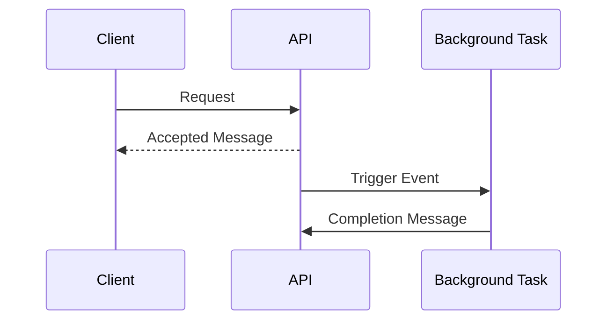
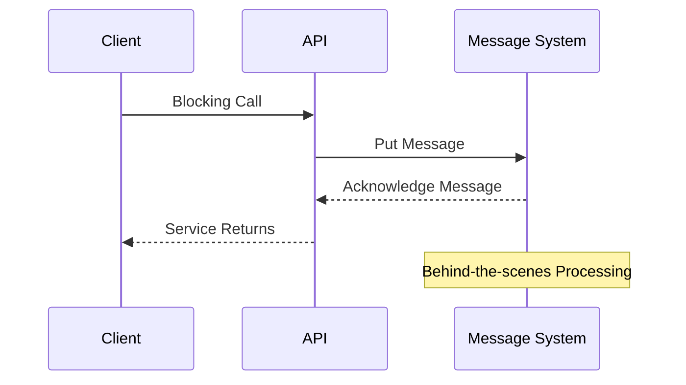
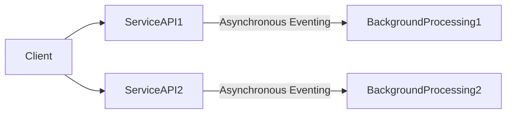

# Asynchronous Eventing in Microservice Architecture Design

Asynchronous eventing plays a crucial role in modern Microservice Architecture, helping to manage long-running transactions and complex workflows that are unsuitable for a single blocking API call. To unravel the intricacies of this model and its utility in distributed systems, we delve into its working, potential use-cases, and benefits. 

## Table of Contents
- [Problem Statement](#problem-statement)
- [Understanding Asynchronous Eventing](#understanding-asynchronous-eventing)
- [Role of Service API in Asynchronous Eventing](#role-of-service-api-in-asynchronous-eventing)
- [Asynchronous Eventing in a Distributed System](#asynchronous-eventing-in-a-distributed-system)
- [Further Reading](#further-reading)

## Problem Statement 

In a microservices architecture, developers often encounter situations where transactions take considerable time or workflows are too complex to fit within a single, blocking API call. Moreover, certain processes cannot be done in real-time through a blocking call. This is where asynchronous eventing becomes instrumental.

## Understanding Asynchronous Eventing 

Asynchronous eventing enables a series of actions to execute in the background, after the client receives an accepted message from the service API. These actions can occur independently of the API, providing flexibility for varying use-cases.

## Role of Service API in Asynchronous Eventing 

In asynchronous eventing, a Service API triggers an event, which subsequently cascades asynchronously from the API. Alternatively, a single blocking call can put a message on a messaging system, and once done, the service returns. The processing then continues in an asynchronous fashion behind the scenes.

## Asynchronous Eventing in a Distributed System 

Asynchronous eventing proves particularly potent in a distributed system, solving numerous complex issues. Though not a panacea for all software issues, it significantly simplifies tackling complexities in distributed systems.

