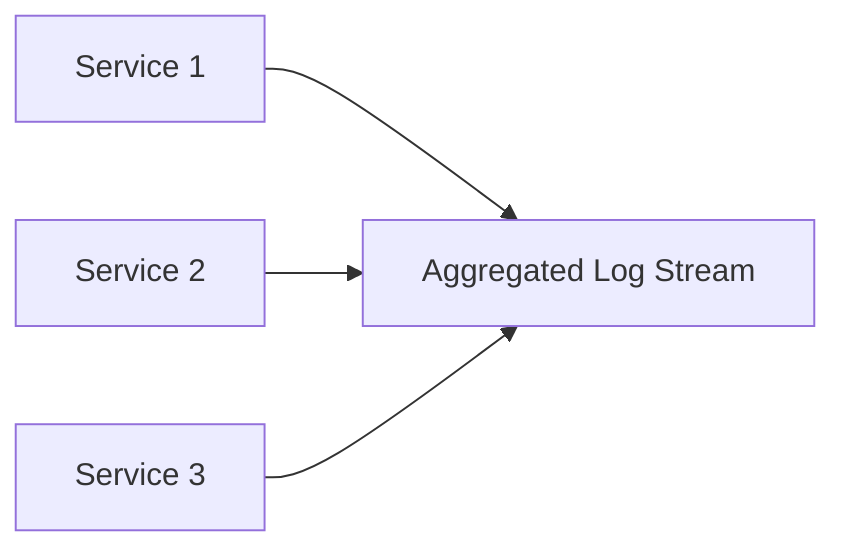

# Log Aggregation Patterns in Microservice Architecture Design

In the landscape of system operation, these patterns play a crucial role in ensuring efficiency and effectiveness in identifying and resolving system issues. Logs, when well-implemented, are instrumental in providing in-depth insights into your microservices' runtime behavior.

## Table of Contents:
- [The Core Concept](#log-aggregation-the-core-concept)
- [The Importance of Log Consistency](#the-importance-of-log-consistency)
- [Understanding Log Aggregation](#understanding-log-aggregation)
- [Log Parsing and Structure](#log-parsing-and-structure)
- [Correlation and Tracing of Log Messages](#correlation-and-tracing-of-log-messages)
- [Indexing of Logs](#indexing-of-logs)
- [Utilizing External Tools](#utilizing-external-tools)

## The Core Concept <a name="log-aggregation-the-core-concept"></a>

Logs are the primary source of operational data, providing crucial information about the system's ongoing processes. When errors arise, logs are among the most reliable resources for identifying and rectifying them. As such, one of the primary operational challenges to solve is ensuring efficient and effective access to logs across all systems. 

## The Importance of Log Consistency <a name="the-importance-of-log-consistency"></a>

The concept of log consistency is vital to the process of log aggregation and indexing. A common structure and format for logs across all microservices ensures smooth operation. This uniformity allows logs from various sources to be written and linked, enhancing readability and usability.

In the face of polyglot programming, maintaining a consistent log output may pose challenges, but the benefits outweigh the time and effort invested. Another crucial element to consider is a common taxonomy. A shared domain-level taxonomy across all services ensures that identifiers and core values in log messages are uniformly keyed and well documented.

## Understanding Log Aggregation <a name="understanding-log-aggregation"></a>

In contrast to monolithic models, where log messages are automatically aggregated due to a single output point, microservice architecture presents a more complex scenario. Here, each service generates its own logs, typically unique per service, which can be challenging to trace in a stateless flow.

Log aggregation, as the name suggests, is a strategy to bring together logs from various sources into a unified stream of data. This single stream allows for faster diagnosis and resolution of issues.



## Log Parsing and Structure <a name="log-parsing-and-structure"></a>

An important part of the aggregation process is log parsing, which aids in structuring the logs. Logs generally contain a message and associated metadata, commonly referred to as tags. More structured logs simplify parsing, as they necessitate a limited set of rules, resulting in speedier aggregation and utilization of log data.

## Correlation and Tracing of Log Messages <a name="correlation-and-tracing-of-log-messages"></a>

Correlation of log messages is integral to fully exploit the potential of log aggregation. Ensuring tracing identifiers are consistently injected into logs across all services, using the same key, can aid in recreating call stacks of faulty processes. Further, a common taxonomy enhances issue identification and provides a clear understanding of what identifiers imply.

## Indexing of Logs <a name="indexing-of-logs"></a>

Indexing of logs, while sometimes considered optional, is a powerful feature to include in a log aggregation system. By indexing logs, rapid searching using a common structure and common taxonomy is made possible, making it a highly recommended practice.

## Utilizing External Tools <a name="utilizing-external-tools"></a>

Leveraging existing tools and frameworks for logging is advisable rather than building your own. Structured logging frameworks exist across almost all languages. Log parsing and shipping tools are also widely available for common aggregation platforms. The focus should be on building a shared taxonomy and documenting it, letting these tools work across the system.

```csharp
// C# code for sending logs to an external tool (like Elasticsearch) using Serilog
using Serilog;
using Serilog.Sinks.Elasticsearch;

class Program
{
    static void Main()
    {
        Log.Logger = new LoggerConfiguration()
            .WriteTo.Elasticsearch(new ElasticsearchSinkOptions(new Uri("http://localhost:9200"))
            {
                AutoRegisterTemplate = true,
            })
            .CreateLogger();

        Log.Information("This is a log message sent to Elasticsearch");
    }
}
```

By understanding and implementing these log aggregation patterns, you can greatly enhance the operation and maintenance of your microservice-based systems.
