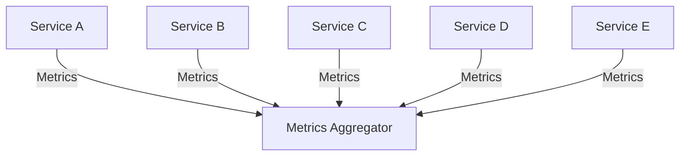
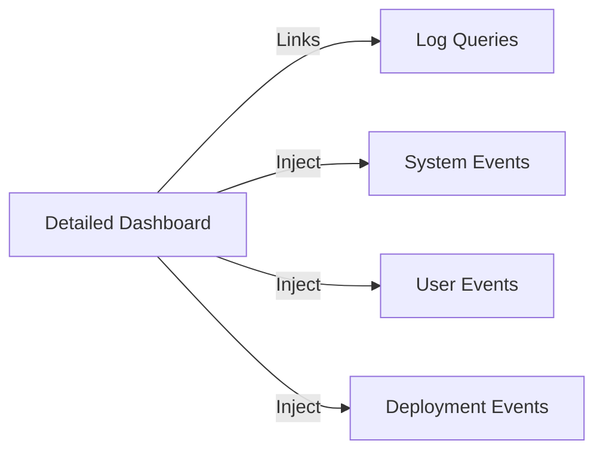

# Aggregation Patterns for Metrics in Microservice Architecture

Metrics aggregation plays an essential role in operating and troubleshooting microservices in system architecture. It assists in issue diagnosis, often more powerfully than logging, provided it is employed accurately. This guide will introduce the principles and best practices for effective metrics aggregation, including suggestions for creating meaningful dashboards and making the most of alarms.

## Table of Contents
- [Understanding Metrics Aggregation](#understanding-metrics-aggregation)
- [Creating Effective Dashboards](#creating-effective-dashboards)
- [Adding Depth to Dashboards](#adding-depth-to-dashboards)
- [Effective Use of Alarms](#effective-use-of-alarms)
- [Maintaining Useful Runbooks](#maintaining-useful-runbooks)

## Understanding Metrics Aggregation <a name="understanding-metrics-aggregation"></a>
Metrics aggregation is about discerning the system's state or service at a macro level. Unlike logging, which demands developers to write and structure the log message, metrics just necessitates a bit of instrumentation.

Metrics may cover system-level and runtime component data points, but it could be beneficial to adorn your metrics dashboards with custom metrics for deeper insight. Generally, standard metrics libraries, available in nearly every programming language, facilitate the generation of these metrics.

Shipping metrics is managed through standard components. You should utilize existing shipping standards of most metrics aggregation solutions. Once shipped, you can visually inspect the metrics via a metrics aggregation solution, usually through dashboards.

```csharp
// Typical metrics instrumentation in C#
using App.Metrics;
using App.Metrics.Counter;

var metrics = new MetricsBuilder().Build();

var counterOptions = new CounterOptions {Name = "my_counter"};
metrics.Measure.Counter.Increment(counterOptions);
```

## Creating Effective Dashboards <a name="creating-effective-dashboards"></a>
Dashboards are powerful tools, especially for on-call activity. It's advisable to build high-level dashboards that your on-call engineer can use to detect potential issues before they escalate. However, these dashboards should not be too cluttered, maintaining a clear picture of the overall system health.



## Adding Depth to Dashboards <a name="adding-depth-to-dashboards"></a>
In addition to high-level dashboards, it is useful to have detailed dashboards for each service. When a problem is suspected, these dashboards can provide more in-depth insight into the system. It's also advisable to include links to log queries within your metrics dashboard. This can save precious time during an outage.

You may want to inject system events and user events into your dashboards. These can assist in understanding the impact on various systems. Deployment events could be added to help identify if newly introduced code is affecting the overall system.



## Effective Use of Alarms <a name="effective-use-of-alarms"></a>
Alarms are important for immediate issue detection. Whenever possible, traces on your graphs at alarm points can be beneficial. A visual representation of the reason for an alarm can expedite the mean time to resolution. Each alarm should have a defined cause.

```csharp
// Example of creating an alarm in C#
Alarm alarm = new Alarm("High CPU Usage");
alarm.SetThreshold(80);
```

## Maintaining Useful Runbooks <a name="maintaining-useful-runbooks"></a>
Runbooks are a vital resource for troubleshooting. They should be maintained for every alarm, providing explanations of metrics and logs to look at. Embedding links to runbooks into the alarms and dashboards makes it easier for on-call engineers, which is the objective of all operational patterns.

In the end, the goals of both metrics and log aggregations are about issue identification and resolution. With clear and consistent metrics, we can maintain healthier systems and quicker troubleshooting.
