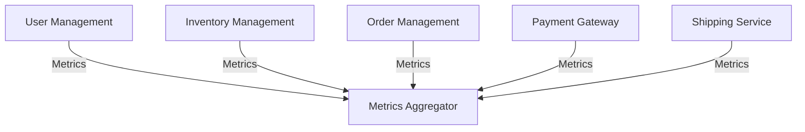
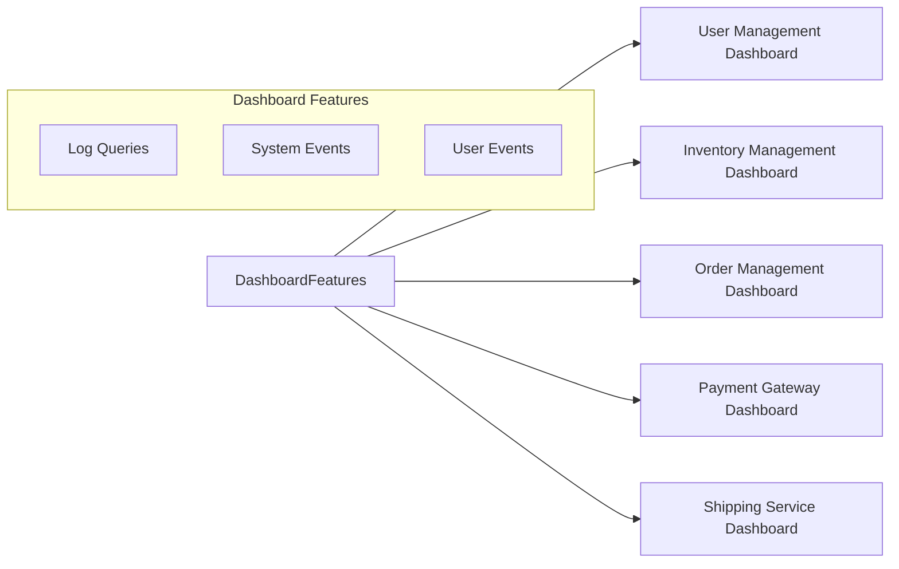

# Aggregation Patterns for Metrics in Microservice Architecture

Metrics aggregation plays an essential role in operating and troubleshooting microservices in system architecture. It assists in issue diagnosis, often more powerfully than logging, provided it is employed accurately. This guide will introduce the principles and best practices for effective metrics aggregation, including suggestions for creating meaningful dashboards and making the most of alarms.

## Table of Contents
- [Understanding Metrics Aggregation](#understanding-metrics-aggregation)
- [Creating Effective Dashboards](#creating-effective-dashboards)
- [Adding Depth to Dashboards](#adding-depth-to-dashboards)
- [Effective Use of Alarms](#effective-use-of-alarms)
- [Maintaining Useful Runbooks](#maintaining-useful-runbooks)

## Understanding Metrics Aggregation <a name="understanding-metrics-aggregation"></a>
Metrics aggregation is about discerning the system's state or service at a macro level. Unlike logging, which demands developers to write and structure the log message, metrics just necessitates a bit of instrumentation.

Metrics may cover system-level and runtime component data points, but it could be beneficial to adorn your metrics dashboards with custom metrics for deeper insight. Generally, standard metrics libraries, available in nearly every programming language, facilitate the generation of these metrics.

Shipping metrics is managed through standard components. You should utilize existing shipping standards of most metrics aggregation solutions. Once shipped, you can visually inspect the metrics via a metrics aggregation solution, usually through dashboards.

```csharp
// Typical metrics instrumentation in C#
using App.Metrics;
using App.Metrics.Counter;

var metrics = new MetricsBuilder().Build();

var counterOptions = new CounterOptions {Name = "my_counter"};
metrics.Measure.Counter.Increment(counterOptions);
```

## Creating Effective Dashboards <a name="creating-effective-dashboards"></a>

Dashboards are powerful tools, particularly for on-call activities. They provide a clear, visual representation of a system's state, helping to highlight potential issues before they escalate into significant problems. These high-level dashboards should maintain an overall view of system health without becoming too cluttered with information.

Imagine we are monitoring an e-commerce application composed of various services such as `User Management`, `Inventory Management`, `Order Management`, `Payment Gateway`, and `Shipping Service`.

For this e-commerce application, a useful high-level dashboard might include key metrics from each service, like:

- **User Management Service:** Active user count, login rate, error rate.
- **Inventory Management Service:** Available inventory count, inventory update frequency, error rate.
- **Order Management Service:** Order creation rate, pending orders count, error rate.
- **Payment Gateway Service:** Payment transaction rate, successful payments, failed payments.
- **Shipping Service:** Shipment creation rate, on-transit shipments, error rate.

These key metrics provide a quick overview of the system's health and can alert on-call engineers to potential issues.

The microservice architecture and the flow of metrics can be visualized as in the following diagram:



This high-level view doesn't exclude the need for more detailed dashboards for each service. However, it provides an aggregated and simplified overview, which is essential for monitoring the system as a whole.


## Adding Depth to Dashboards <a name="adding-depth-to-dashboards"></a>

While high-level dashboards provide a broad overview of the system health, there are situations where more granular detail is required for each service. These details are presented in dedicated dashboards for each service.

For instance, let's continue with our e-commerce application example. Here's what a more detailed dashboard for each service might look like:

- **User Management Service Dashboard:** Total users, new users per day, active users per day, failed login attempts, account creation errors, etc.

- **Inventory Management Service Dashboard:** Inventory levels per product, average inventory level, product out-of-stock events, inventory update errors, etc.

- **Order Management Service Dashboard:** Total orders, new orders per day, orders in progress, cancelled orders, order completion time, order processing errors, etc.

- **Payment Gateway Service Dashboard:** Successful transactions, failed transactions, transaction volume, average transaction time, transaction errors, etc.

- **Shipping Service Dashboard:** Total shipments, new shipments per day, shipments in transit, delayed shipments, shipment delivery errors, etc.

This increased level of detail can help identify issues within specific services and facilitate faster troubleshooting. Furthermore, you could inject system events and user events into these dashboards. These can help identify the impact on various systems. Additionally, deployment events could help identify if newly introduced code is affecting the overall system.

Embedding links to related log queries directly into these detailed dashboards can provide easy access to additional information if needed, especially during a system outage.

The structure of the detailed dashboards, in relation to each microservice and how they communicate with one another, can be visualized using the following Mermaid diagram:



This expanded view enables you to drill down into a specific service to gain a more in-depth understanding, thereby facilitating more accurate troubleshooting.

## Effective Use of Alarms <a name="effective-use-of-alarms"></a>
Alarms are important for immediate issue detection. Whenever possible, traces on your graphs at alarm points can be beneficial. A visual representation of the reason for an alarm can expedite the mean time to resolution. Each alarm should have a defined cause.

```csharp
// Example of creating an alarm in C#
Alarm alarm = new Alarm("High CPU Usage");
alarm.SetThreshold(80);
```

## Maintaining Useful Runbooks <a name="maintaining-useful-runbooks"></a>
Runbooks are a vital resource for troubleshooting. They should be maintained for every alarm, providing explanations of metrics and logs to look at. Embedding links to runbooks into the alarms and dashboards makes it easier for on-call engineers, which is the objective of all operational patterns.

In the end, the goals of both metrics and log aggregations are about issue identification and resolution. With clear and consistent metrics, we can maintain healthier systems and quicker troubleshooting.
