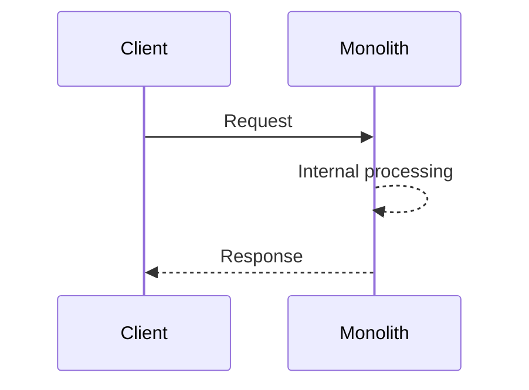
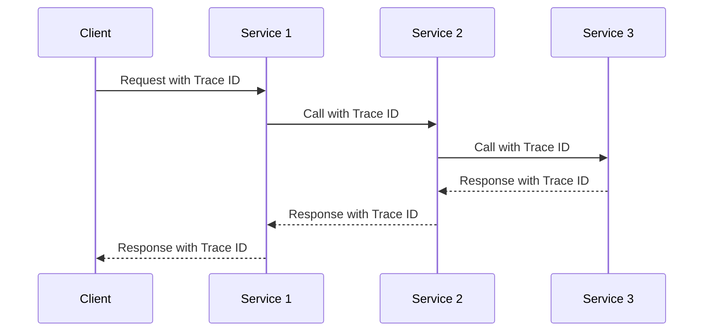

# Tracing Patterns in Microservice Architecture Design

Tracing is an essential part of microservices-based systems, assisting in maintaining visibility in complex call stacks that span multiple processes and networks. This guide will dive into the fundamental concepts of tracing patterns in microservice architecture and share the best practices to implement them effectively, using open standards for simplicity and interoperability.

## Table of Contents
- [Tracing in Monolithic vs Microservices Architecture](#tracing-in-monolithic-vs-microservices-architecture)
- [Tracing Patterns Implementation](#tracing-patterns-implementation)
- [Using APM for Visualizing Call Stacks](#using-apm-for-visualizing-call-stacks)
- [Leveraging Existing Patterns](#leveraging-existing-patterns)

## Tracing in Monolithic vs Microservices Architecture 

In a monolithic architecture, tracing the execution path from the edge to a database call is relatively straightforward, as all operations occur within a single process.

In contrast, microservices architectures involve multiple processes across a network. As such, traditional code tracing methods may not be sufficient to recreate the path of a service call. Tracing techniques in a microservices system inject a trace identifier into every call, which helps recreate the call stack.

## Tracing Patterns Implementation 

Implementing tracing patterns in a microservices architecture involves a few key steps:

1. **Inject a Trace Identifier:** The trace identifier should be injected into the entry point of your system (e.g., a browser, an edge service, an ETL process). This identifier should span across all calls, even into the database if possible.

2. **Standardized Approach:** Avoid reinventing the wheel with a home-grown pattern and instead use an open standards-based approach. This allows you to use off-the-shelf tools to inspect your system.

3. **Embed the Trace ID in Log Messages:** With the trace identifier in place, you can easily embed this ID into all logs associated with a call. This provides an invaluable resource for diagnosing issues later on.

## Using APM for Visualizing Call Stacks 

Application Performance Monitoring (APM) tools can visualize call stacks, offering valuable insights into your system's behavior. Especially during troubleshooting, these visuals can significantly simplify understanding the path a service call takes.

## Leveraging Existing Patterns 

Tracing in microservices does not require recreating the wheel. Several robust tracing patterns already exist for systems as a whole, which also play nicely with microservices. It's highly recommended to use these pre-existing patterns and tools for building your system's tracing.
