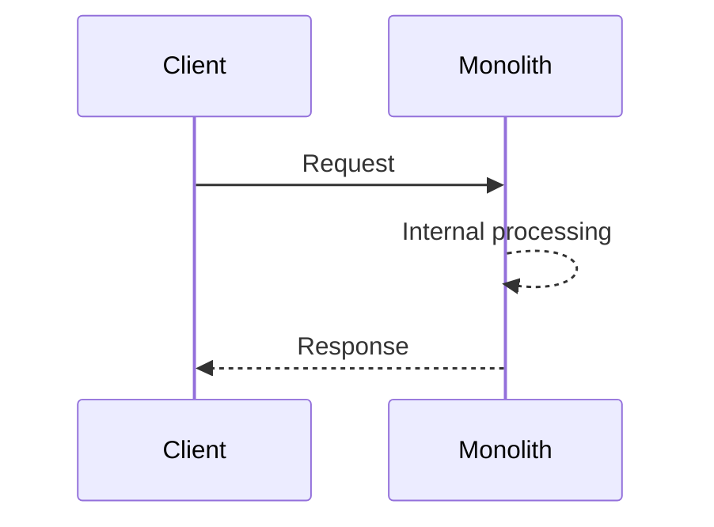
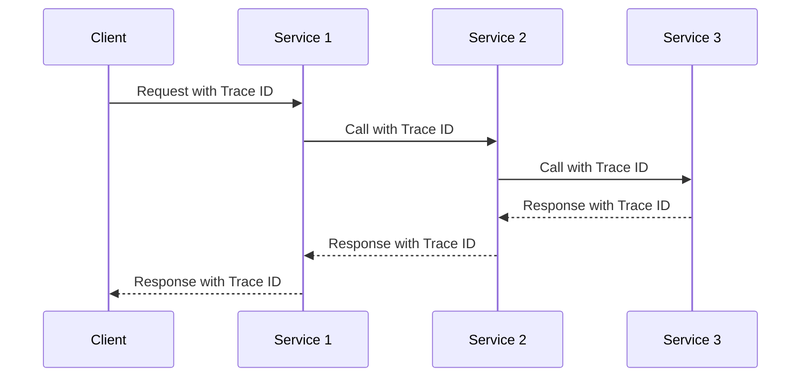
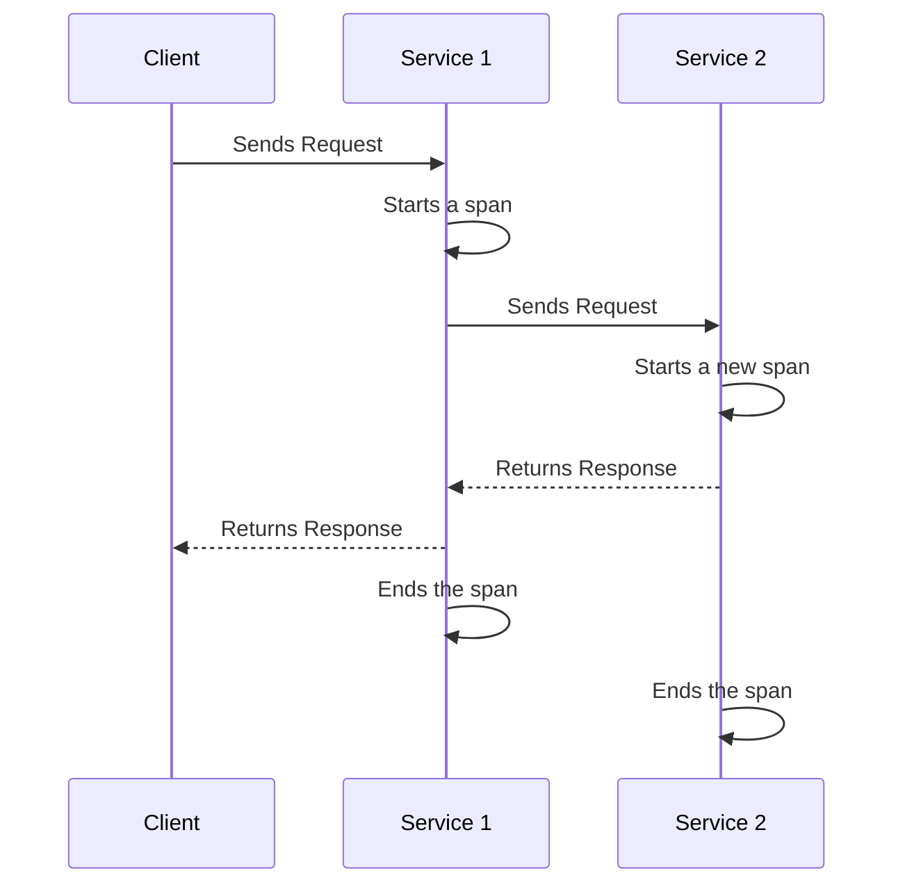

# Tracing Patterns in Microservice Architecture Design

Tracing is an essential part of microservices-based systems, assisting in maintaining visibility in complex call stacks that span multiple processes and networks. This guide will dive into the fundamental concepts of tracing patterns in microservice architecture and share the best practices to implement them effectively, using open standards for simplicity and interoperability.

## Table of Contents
- [Tracing in Monolithic vs Microservices Architecture](#tracing-in-monolithic-vs-microservices-architecture)
- [Tracing Patterns Implementation](#tracing-patterns-implementation)
- [Using APM for Visualizing Call Stacks](#using-apm-for-visualizing-call-stacks)
- [Leveraging Existing Patterns](#leveraging-existing-patterns)
  - [OpenTelemetry](#opentelemetry)
  - [Exporters](#exporters)

## Tracing in Monolithic vs Microservices Architecture <a name="tracing-in-monolithic-vs-microservices-architecture"></a>

In a monolithic architecture, tracing the execution path from the edge to a database call is relatively straightforward, as all operations occur within a single process.



In contrast, microservices architectures involve multiple processes across a network. As such, traditional code tracing methods may not be sufficient to recreate the path of a service call. Tracing techniques in a microservices system inject a trace identifier into every call, which helps recreate the call stack.



## Tracing Patterns Implementation <a name="tracing-patterns-implementation"></a>

Implementing tracing patterns in a microservices architecture involves a few key steps:

1. **Inject a Trace Identifier:** The trace identifier should be injected into the entry point of your system (e.g., a browser, an edge service, an ETL process). This identifier should span across all calls, even into the database if possible.

2. **Standardized Approach:** Avoid reinventing the wheel with a home-grown pattern and instead use an open standards-based approach. This allows you to use off-the-shelf tools to inspect your system.

3. **Embed the Trace ID in Log Messages:** With the trace identifier in place, you can easily embed this ID into all logs associated with a call. This provides an invaluable resource for diagnosing issues later on.

## Using APM for Visualizing Call Stacks <a name="using-apm-for-visualizing-call-stacks"></a>

Application Performance Monitoring (APM) tools are instrumental in managing and observing your applications. They gather data about the performance and behavior of your software, which includes visualizing the call stacks. Let's explore a couple of real-world examples:

1. **New Relic:** New Relic is a popular APM tool that provides comprehensive insights about your application's performance. It captures detailed information about transactions, exceptions, and even SQL queries. The Distributed Tracing feature of New Relic provides a waterfall-style visualization of the call stack, which helps in quickly understanding bottlenecks in the system.

    To use New Relic in a .NET application, you would generally install the New Relic APM Agent on your server and instrument your code with New Relic's API.

    ```csharp
    using NewRelic.Api.Agent;

    [Transaction]
    public string SomeMethod()
    {
        // Your method logic here
    }
    ```

2. **Datadog:** Datadog is another widely used APM tool that allows you to trace requests across various services in your environment. Datadog also provides Flame Graphs that offer a visual representation of your traced requests, which allows developers to see where in the stack the most time was spent on a request.

    Datadog provides libraries to instrument your applications. For .NET applications, you would add the Datadog .NET Tracer package and use the provided tracer instance.

    ```csharp
    using Datadog.Trace;

    // Start a new span
    using (var scope = Tracer.Instance.StartActive("custom-operation"))
    {
        // Access the span through the scope
        var span = scope.Span;
        span.ServiceName = "custom-service";
        span.ResourceName = "custom-resource";
    }
    ```

These examples showcase how APM tools can provide insights into your system's performance and allow you to pinpoint areas of improvement by visualizing call stacks and other important metrics. Each tool has its own set of features and capabilities, so it's essential to choose the one that best suits your application's requirements.

## Leveraging Existing Patterns <a name="leveraging-existing-patterns"></a>

Embracing open standards and leveraging existing patterns can help simplify the implementation of tracing in a microservices architecture. Open standards allow you to utilize off-the-shelf tooling to introspect your system, which helps keep your team focused on building features rather than reinventing the wheel. The following is an overview of OpenTelemetry and how it can be utilized in microservice architectures.

### OpenTelemetry

OpenTelemetry is a set of APIs, SDKs, tooling, and integrations that are designed for the creation and management of telemetry data such as traces, metrics, and logs. It is a Cloud Native Computing Foundation (CNCF) project that provides a vendor-neutral, wide-reaching standard that allows developers to instrument their code once and send telemetry data to any backend.

OpenTelemetry supports a wide range of languages including .NET, Java, JavaScript, Python, Go, and many others. It provides libraries for automatic and manual instrumentation of your applications.

The following diagram demonstrates how tracing with OpenTelemetry works:



In this sequence diagram, when the client sends a request to Service 1, OpenTelemetry starts a new span. When Service 1 calls Service 2, OpenTelemetry automatically injects the current span context into the outgoing request. Service 2 extracts this context from the incoming request and starts a new span, which is a child of the span in Service 1. When the response is returned to the client, the spans in both Service 1 and Service 2 are ended.

With OpenTelemetry, all these processes are handled for you automatically, so you only need to focus on instrumenting your application where it makes sense to do so. 

### Exporters

While OpenTelemetry provides APIs and libraries to generate and manage telemetry data, which includes traces, metrics, and logs, it does not include a backend system for storing and analyzing this data. That's where tools like Jaeger, Zipkin, AWS X-Ray, etc. come in.

These tools, often called exporters or backends, are responsible for collecting the telemetry data generated by OpenTelemetry and storing it for later analysis. The OpenTelemetry project provides a number of exporters that can send data to different backends. Jaeger, Zipkin, AWS X-Ray, and others are some of the popular backends that you can use with OpenTelemetry.

Here is how it works:

1. You instrument your application using the OpenTelemetry API, generating telemetry data.
2. This data is collected by the OpenTelemetry SDK.
3. The SDK sends the data to one or more exporters.
4. Each exporter sends the data to a specific backend (like Jaeger, Zipkin, or AWS X-Ray).

This design allows you to switch backends with minimal changes to your code. You simply need to swap the exporter and configure it for your new backend. It also allows you to send data to multiple backends simultaneously, which can be useful for migration or for integrating with different tools for different purposes (e.g., sending trace data to Jaeger for analysis, while also sending it to a logging backend for long-term archival).
