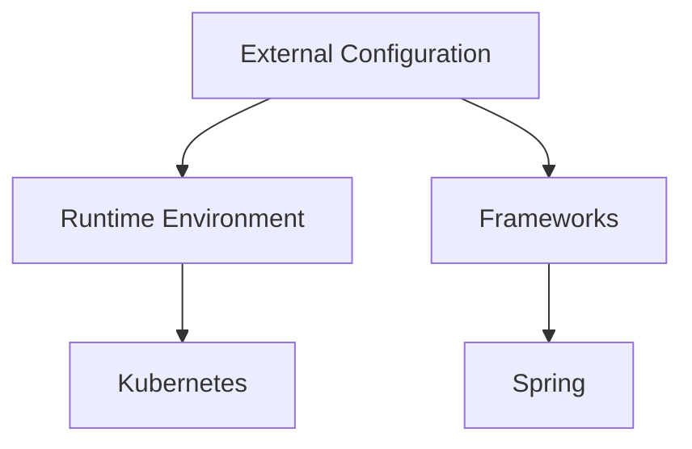
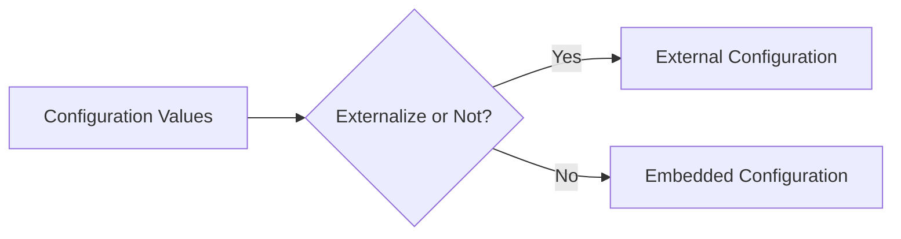
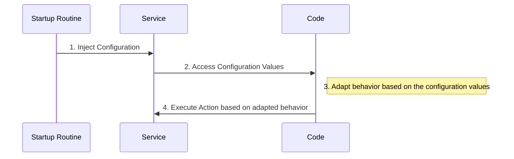

# External Configuration in Microservice Architecture Design

In the field of microservices architecture, the role of externalized configuration may not be considered a mandatory requirement akin to cloud native design, but its operational importance can't be underestimated. Particularly, when load and service movement start to occur, the ability to view and manipulate configuration outside of code becomes a crucial factor in minimizing resolution time during system issues.

## Table of Contents

- [Understanding Externalized Configuration](#understanding-externalized-configuration)
- [Choosing Frameworks and Tools](#choosing-frameworks-and-tools)
- [Naming and Externalization](#naming-and-externalization)
- [Protecting Secrets](#protecting-secrets)
- [Pattern of External Configuration](#pattern-of-external-configuration)
- [Summary](#summary)

## Understanding Externalized Configuration <a name="understanding-externalized-configuration"></a>

The approach to externalizing your configuration can differ based on your runtime environment and the frameworks you're using. Certain runtimes like Kubernetes and frameworks such as Spring offer robust models for injecting configuration into your application. However, several other tools also facilitate this process.



## Choosing Frameworks and Tools <a name="choosing-frameworks-and-tools"></a>

When it comes to tooling, the goal should be to select those that simplify the discovery and manipulation of external environmental variables. Consistent naming can also aid significantly in this regard. From an operational perspective, if a variable is consistently called 'X', except in one specific case, troubleshooting the exception can become needlessly time-consuming.

Let's look at examples of how external configuration is handled in Kubernetes and .NET Core.

### Kubernetes

Kubernetes, an open-source platform for managing containerized workloads and services, provides two primary mechanisms for injecting configuration into a container: ConfigMaps and Secrets.

**ConfigMaps** allow you to decouple configuration details from container image content to keep containerized applications portable. This resource is used to store non-confidential data in key-value pairs.

```yaml
apiVersion: v1
kind: ConfigMap
metadata:
  name: example-config
data:
  example.property: "example value"
```

You can inject this data into your application as environment variables or as a file in a volume.

**Secrets** are used to store sensitive information, such as passwords, OAuth tokens, and ssh keys.

```yaml
apiVersion: v1
kind: Secret
metadata:
  name: example-secret
type: Opaque
data:
  secret.property: "example secret value"
```

Similar to ConfigMaps, Secrets can also be mounted as data volumes or exposed as environment variables to the containers.

### .NET Core

.NET Core, a free, cross-platform, open-source framework, also provides robust support for externalized configuration.

In .NET Core, you typically use an appsettings.json file for configuration. This file should be located in the root directory of your project.

```json
{
  "ExampleProperty": "example value"
}
```

Environment variables can also be used to override these properties:

```powershell
$env:ExampleProperty="example value"
```

In your .NET Core classes, you can access these properties by injecting an instance of `IConfiguration` into your class:

```csharp
public class ExampleClass
{
    private readonly IConfiguration _configuration;

    public ExampleClass(IConfiguration configuration)
    {
        _configuration = configuration;
    }

    public void ExampleMethod()
    {
        var exampleProperty = _configuration["ExampleProperty"];
        // Do something with exampleProperty
    }
}
```

It's also worth noting that you can use these two mechanisms together in a .NET Core application running in a Kubernetes environment. For example, you can use a Kubernetes ConfigMap to store your configuration settings and then inject these settings as environment variables into your .NET Core application's containers. Your .NET Core application can then use its configuration API to retrieve these values.

## Naming and Externalization <a name="naming-and-externalization"></a>

As for deciding which configuration values should be externalized, it's always better to lean towards externalization. Over-exposing configuration does little harm, whereas under-exposing can complicate resolution and troubleshooting processes. 



## Protecting Secrets <a name="protecting-secrets"></a>

Protecting secrets is a crucial aspect of any software system, including those using a microservices architecture. Secrets refer to sensitive data that your application needs to operate securely and might include API keys, database credentials, JWT (JSON Web Tokens) secrets, and more. 

It's generally a best practice to externalize such secrets and not store them directly in your application code or version control system. Embedding such secrets in the code can lead to serious security risks, such as unintended exposure, if the code is publicly accessible or becomes compromised.

Here's a common approach to manage and protect secrets in a microservices architecture:

### Secret Management Systems

A Secret Management System provides a centralized and secure way to store, access, and manage secrets. These systems use encryption to protect your secrets and control access to them. They also provide audit logging capabilities to track when and by whom a secret was accessed.

Some popular Secret Management Systems include:

- **HashiCorp's Vault**: An open-source tool for secrets management, Vault encrypts and stores secrets, provides access control, and generates audit logs. Vault supports dynamic secrets, creating on-demand, short-lived access to systems, which minimizes the risk associated with compromised credentials.

- **AWS Secrets Manager**: This service helps to easily rotate, manage, and retrieve database credentials, API keys, and other secrets throughout their lifecycle. AWS Secrets Manager protects access to your applications, services, and IT resources without upfront costs or on-going maintenance tasks.

- **Azure Key Vault**: Azure Key Vault is a cloud service for securely storing and accessing secrets. It provides secret management, key management, and certificate management. Azure Key Vault allows you to centrally manage keys, secrets, and certificates, providing secure cloud storage for sensitive information.

In a microservices architecture, each service would fetch the required secrets from the Secret Management System during startup or when needed. By adopting this practice, you can enhance security and simplify the management of secrets.

```csharp
public class SecretsService
{
    private readonly ISecretsManager _secretsManager;

    public SecretsService(ISecretsManager secretsManager)
    {
        _secretsManager = secretsManager;
    }

    public string GetSecret(string secretName)
    {
        return _secretsManager.GetSecret(secretName);
    }
}
```

Please note that it's also important to ensure secure transmission and handling of these secrets within your application to maintain their confidentiality and integrity. This could include using secure connections (HTTPS/TLS) and limiting exposure of secrets in logging or error messages.

## Pattern of External Configuration <a name="pattern-of-external-configuration"></a>

The pattern of external configuration in a service typically follows these steps:

1. **Inject Configuration into Service**: During the startup routine of the application or microservice, external configuration values are fetched and injected into the service. This configuration data may include information such as database connection details, environment-specific variables, and more.

2. **Access Configuration Values**: The injected configuration values are then made available to the code. This could mean setting properties on an object, populating a configuration dictionary, or storing the values in environment variables.

3. **Adapt Behavior Based on Configuration**: The code accesses these configuration values and adjusts its behavior based on them. This could mean connecting to a different database for a test environment versus a production environment, setting debug flags, and so on.

4. **Execute Actions Based on Adapted Behavior**: The service carries out actions according to the behavior adjusted to match the configuration. For instance, if the configuration indicates that the service is running in a production environment, it might connect to a specific database and start listening on certain network ports.

This pattern emphasizes the value of externalizing configuration in the design of microservices architecture, allowing services to be more adaptable and manageable.



## Summary <a name="summary"></a>

Understanding and effectively implementing externalized configuration is a key aspect of successful microservices architecture design. Through the smart selection of tools and frameworks, consistent naming, protecting secrets, and adhering to the pattern of external configuration, one can achieve a flexible and resilient system capable of adapting to changing needs while facilitating quick resolution of issues. 

Remember, the overall goal is operational efficiency. Your design choices should always aim to simplify the tasks of your on-call engineers and reduce the mean time to resolution.
